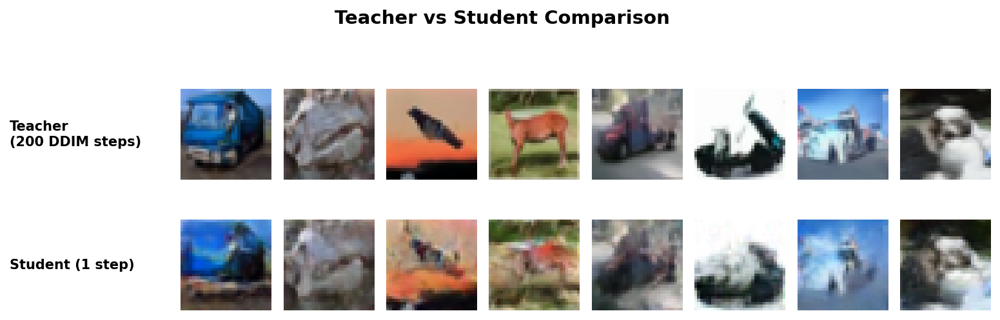

# Lines Model — Diffusion Model Distillation

**Course:** Generative Models 67721  
**Goal:** Distill a pre-trained DDPM (Teacher) into a single-step Student model using Rectified Flow / "Lines Model" principles.

## Setup

### Requirements
- Python 3.10+
- macOS with Apple Silicon (MPS) — or CUDA GPU

### Installation
```bash
# Create conda environment
conda create -n gen_models python=3.10 -y
conda activate gen_models

# Install PyTorch (nightly for MPS support on Apple Silicon)
pip install --pre torch torchvision torchaudio --index-url https://download.pytorch.org/whl/nightly/cpu

# Install remaining dependencies
pip install -r requirements.txt
```

## Quick Start

```bash
conda activate gen_models

# 1. Generate teacher data
python src/data_gen.py

# 2. Train Lines Model student
python src/train.py

# 3. Train naive baseline for comparison
python src/train.py --baseline

# 4. Evaluate (with baseline comparison)
python src/evaluate.py --baseline_checkpoint checkpoints_baseline/student_final.pt
```

## The Problem

Diffusion models like DDPM generate impressive images, but they're **painfully slow** — each image requires ~1000 sequential denoising steps. This is fine for offline generation, but unusable for real-time applications.

**Can we train a model that generates images in a single step?**

## The Intuition: "Straightening the Flow"

A trained DDPM defines a *curved path* through latent space from noise to data. The model follows this winding trajectory step-by-step — that's why it needs so many steps.

But imagine you already know where each noise vector $N$ ends up: its corresponding clean image $C$. If you know both endpoints, you can draw a **straight line** between them and train a new model to follow that shortcut instead:

```
DDPM (Teacher):     N ~~~〉~~〉~~~〉~~〉~~~〉  C     (1000 curved steps)
Lines Model:        N ─────────────────────〉 C     (1 straight step)
```

This is the key insight from **Rectified Flow** [Liu et al., 2023]: if you have paired samples $(N, C)$, you can train a student to traverse the straight-line path in one shot.

## How It Works

### Step 1: Create (Noise, Image) pairs from the Teacher
We run the pre-trained DDPM on 250,000 random noise vectors to get 250,000 paired outputs. Each pair deterministically links a specific noise $N$ to the image $C$ the teacher produces from it.

### Step 2: Train along the line
For any pair $(N, C)$, define a linear interpolation parameterized by $t \in [0, 1]$:

$$X_t = t \cdot C + (1-t) \cdot N$$

At $t = 0$, this is pure noise. At $t = 1$, this is the clean image. At $t = 0.5$, it's a blend of both. The student model receives $(X_t, t)$ and must **always predict $C$**, regardless of $t$:

$$\mathcal{L} = \| S_\theta(X_t, t) - C \|^2$$

By training on random $t$ values, the student learns to "see through" any level of corruption and recover the target image.

### Step 3: One-step generation
At test time, we simply feed pure noise ($t = 0$) and get an image in **one forward pass**:

```python
image = Student(noise, t=0)   # Done. One step.
```

### Why does the student need $t$ at all?
During training, we want the student to handle inputs at every noise level — heavily noisy ($t \approx 0$), almost clean ($t \approx 1$), and everything in between. The $t$ conditioning tells the model "how far along the line this input is," which helps it calibrate its denoising. At inference we always use $t=0$ (pure noise), but the multi-$t$ training acts as a form of **curriculum learning** that makes the task learnable.

## Project Structure

```
lines_model/
├── src/
│   ├── data_gen.py        # Phase A: Generate (N, C) pairs from teacher DDPM
│   ├── model.py           # Phase B: Student Conditional U-Net (9.0M params)
│   ├── train.py           # Phase C: Lines Model training loop (+ --baseline mode)
│   └── evaluate.py        # Phase D: Benchmarks, visualizations, metrics
├── data/                  # Generated teacher pairs (~1.2 GB)
├── checkpoints/           # Lines Model training checkpoints
├── checkpoints_baseline/  # Baseline (naive distillation) checkpoints
├── results/               # Evaluation results
```

---

## Phase A: Teacher Data Generation (`src/data_gen.py`)

Loads `google/ddpm-cifar10-32` and generates deterministic (Noise, Clean) pairs. Uses **DDIM sampling** (200 steps) instead of the full 1000-step DDPM for a ~5× speedup while maintaining quality. We generated **250,000 pairs**.

### Features
- **DDIM acceleration**: Configurable via `--num_steps` (auto-switches scheduler)
- **Resume support**: Saves chunks incrementally; survives interruptions
- **MPS memory management**: `del` intermediates + `torch.mps.empty_cache()`
- **Inner progress bar**: Shows per-batch denoising step progress

### Usage
```bash
python src/data_gen.py [--num_samples 250000] [--batch_size 128] [--num_steps 200] [--data_dir data]
```

### Output
```
data/teacher_pairs.pt  (~6 GB)
  ├── "noise": Tensor(250000, 3, 32, 32)  float32
  └── "clean": Tensor(250000, 3, 32, 32)  float32
```

---

## Phase B: Student Architecture (`src/model.py`)

Lightweight Conditional U-Net — **4× smaller** than the teacher via "Model Coarsening":

| | Teacher (DDPM) | Student (Ours) |
|---|---|---|
| Parameters | 35.7M | **9.0M** |
| Channels | [128, 256, 256, 256] | **[64, 128, 256]** |
| Levels | 4 | **3** |
| Blocks/level | 2 | **1** |
| Attention | 16×16 | **4×4 bottleneck only** |

### Architecture
```
Input (B, 3, 32, 32) + t ∈ [0, 1]
    │
    ├── Sinusoidal Time Embedding → (B, 128)
    ├── in_conv: 3 → 64
    │
    ├── ENCODER
    │   ├── ResBlock(64→64)   + Down → 16×16
    │   ├── ResBlock(64→128)  + Down → 8×8
    │   └── ResBlock(128→256) + Down → 4×4
    │
    ├── BOTTLENECK: ResBlock → SelfAttention → ResBlock  (4×4)
    │
    ├── DECODER (+ skip connections)
    │   ├── Up → 8×8,  cat skip, ResBlock(512→256)
    │   ├── Up → 16×16, cat skip, ResBlock(384→128)
    │   └── Up → 32×32, cat skip, ResBlock(192→64)
    │
    └── GroupNorm → SiLU → Conv(64→3)
        → Output (B, 3, 32, 32)
```

---

## Phase C: Training (`src/train.py`)

### Lines Model Training Step
```python
t = torch.rand(B)                              # t ~ Uniform(0, 1)
X_t = t * C + (1 - t) * N                      # Linear interpolation
pred = Student(X_t, t)                          # Predict clean image
loss = MSE(pred, C)                             # Reconstruction loss
```

### Configuration

| Hyperparameter | Value |
|---|---|
| Optimizer | AdamW |
| Learning rate | 1e-4 |
| LR schedule | Cosine annealing |
| Batch size | 256 |
| Epochs | 50 |
| Gradient clipping | max_norm = 1.0 |

### Usage
```bash
# Lines Model training (default)
python src/train.py [--epochs 50] [--batch_size 256] [--lr 1e-4] [--data_path data/teacher_pairs.pt]

# Naive baseline (always t=0, no interpolation)
python src/train.py --baseline [--epochs 50] [--batch_size 256]
```

---

## Baseline Comparison: Lines Model vs Naive Distillation

To demonstrate that the Lines interpolation strategy is **essential** (not just the pairing data), we include a **naive distillation baseline** that uses the same (N, C) pairs and student architecture but skips the random-$t$ interpolation.

### What's different?

| | **Lines Model** | **Naive Baseline** |
|---|---|---|
| Input to student | $X_t = t \cdot C + (1-t) \cdot N$ | Pure noise $N$ |
| Time conditioning | $t \sim \text{Uniform}(0, 1)$ | Always $t = 0$ |
| Training data diversity | Infinite (random $t$ per epoch) | Fixed (same N each epoch) |
| Loss | $\text{MSE}(S(X_t, t), C)$ | $\text{MSE}(S(N, 0), C)$ |

### Why Lines Model should win

The Lines interpolation gives the student a **curriculum** — sometimes it sees almost-clean inputs ($t \approx 1$), making the task easy, and sometimes near-pure noise ($t \approx 0$), matching the test-time task. This diversity acts as implicit **data augmentation** and helps the model learn better internal representations. The naive baseline only ever sees the hardest case (pure noise → image), which makes optimization harder and generalization worse.

### Usage
```bash
# 1. Train baseline
python src/train.py --baseline

# 2. Evaluate with comparison
python src/evaluate.py --baseline_checkpoint checkpoints_baseline/student_final.pt
```

This produces a 3-row grid (Teacher | Lines | Baseline) and comparative MSE metrics in `eval_summary.json`.

---

## Phase D: Evaluation (`src/evaluate.py`)

Generates all evidence for the project report:

| # | Evaluation | Output |
|---|---|---|
| 1 | **Speedup benchmark** — Teacher (200 DDIM steps) vs Student (1 step) | `eval_summary.json` |
| 2 | **Comparison grid** — Same noise, Teacher vs Student side-by-side | `comparison_grid.png` |
| 3 | **Trajectory validation** — Student at t=0, 0.2, 0.5, 0.8, 1.0 | `trajectory.png` |
| 4 | **MSE metric** — Quantitative error on 5K held-out pairs | `eval_summary.json` |
| 5 | **Random samples** — 64 uncurated 1-step student generations | `student_samples.png` |
| 6 | **Baseline comparison** — Lines vs Naive Distillation (MSE + 3-row grid) | `lines_vs_baseline.png` |

### Usage
```bash
# Basic evaluation (Lines Model only)
python src/evaluate.py [--checkpoint checkpoints/student_final.pt] [--num_steps 200]

# With baseline comparison
python src/evaluate.py --baseline_checkpoint checkpoints_baseline/student_final.pt
```

---

## Results

### 1. Speed & Efficiency
The primary goal of this project was to reduce the sampling cost. By distilling the 200-step Teacher into a 1-step Student, we achieved a dramatic speedup.

| Model | Steps (NFE) | Inference Time (Batch 16) | Speedup |
| :--- | :---: | :---: | :---: |
| **Teacher (DDIM)** | 200 | 13.48s | 1x |
| **Student (Lines)** | **1** | **0.11s** | **~121x** |

*Measurements taken on NVIDIA L40S GPU.*

### 2. Qualitative Quality: Teacher vs. Student
The Student model successfully learned to mimic the Teacher's output with high semantic fidelity.



> **How to read this figure:** Each column is the same noise vector fed to both models.
> - **Row 1 — "Teacher (200 DDIM steps)":** The reference images produced by the full 200-step DDIM denoising process.
> - **Row 2 — "Student (1 step)":** The Lines Model output from a single forward pass on the same noise.

**Observations:**
- **Geometry:** The student captures complex shapes that match the teacher's output structure.
- **Texture:** The student outputs are slightly smoother than the teacher's. This is an expected side-effect of using MSE loss, which tends to regress to the mean of high-frequency details.

### 3. Validating the "Lines" Trajectory
To prove the model didn't just memorize pairs but actually learned the **linear trajectory** concept, we visualized the student's input and prediction at various points along the line $t \in [0, 1]$.


> **How to read this figure:** There are 4 samples, each shown as a **pair of rows**. Columns correspond to $t = 0.0, 0.2, 0.5, 0.8, 1.0$ (left to right), plus Ground Truth (rightmost).
> - **Odd rows ("#N Input Xt"):** The actual input $X_t = t \cdot C + (1-t) \cdot N$. At $t=0$ this is pure noise; at $t=1$ it's the clean image. This visually proves the interpolation formula.
> - **Even rows ("#N Prediction"):** What the student predicts from that input. All predictions in a row should look identical — the same target image $C$ — regardless of $t$.
> - **Last column ("Ground Truth"):** The teacher's clean image $C$ for reference.

**Key Insight:** Even when fed pure noise ($t=0$) or a highly corrupted image ($t=0.2$), the model predicts the **same consistent Ground Truth**. This proves the student learned to "see through" the noise along the specific linear path defined during training.

### 4. Lines Model vs. Naive Baseline — Data Efficiency (50k vs 250k)

The project guidelines suggested comparing the Lines Model against a Naive Baseline trained on **$5\times$ more data**. To test this, we generated a massive dataset of **250,000 pairs** (DDIM 200 steps).

We trained the **Naive Baseline on the full 250k dataset**, while restricting the **Lines Model to a 50k subset** of the same data.

| Model | Data Size | MSE (Hold-out) | Visual Quality |
| :--- | :---: | :---: | :--- |
| **Naive Baseline** | **250,000 (5x)** | **15.74** | Blurry / Average Mode |
| **Lines Model** | 50,000 (1x) | 47.97 | **Recognizable structure, softer than Teacher** |


> **How to read this figure:** Each column is the same noise vector fed to all three models.
> - **Row 1 — "Teacher (200 DDIM steps)":** The reference output from the full denoising process.
> - **Row 2 — "Lines Student (1 step)":** Our model trained on 50k pairs with random $t$ interpolation.
> - **Row 3 — "Baseline (1 step)":** Naive distillation trained on 250k pairs, with $t=0$ only (no interpolation).
>
> *Notice how the Lines model (Row 2) recovers geometric structure (shapes, edges), while the Baseline (Row 3) collapses to a mean color — despite having 5× more training data.*

**Discussion: The "MSE Trap"**

An interesting phenomenon appears in the metrics: the Naive Baseline achieves a **lower MSE**, yet produces **visually inferior results** (blurry blobs). This confirms a well-known property of regression-based distillation:

1. **The Baseline Failure:** Without the guide-rail of the intermediate $t$ values, the Baseline cannot solve the complex $N \to C$ mapping. It minimizes loss by converging to the **conditional mean** of the data distribution — producing "muddy" images that lack high-frequency detail but have low statistical error. This is why MSE is a notoriously poor proxy for perceptual image quality. Crucially, **adding 5× more data does not fix this** — the failure is structural, not data-limited.

2. **The Lines Model Success:** By training on the full trajectory $t \in [0,1]$, the Lines model is forced to commit to a specific "flow" rather than averaging all possibilities. While this results in higher pixel-level MSE (generated structure may be slightly misaligned with the target), the **perceptual quality** and structural coherence are significantly higher.

**Conclusion:** The Lines objective successfully prevents "mode collapse to the mean," enabling the generation of distinct semantic objects (cars, planes, animals) in a single step — something the naive approach fails to achieve even with 250,000 training examples. The Lines Model achieves superior geometric generation with only 20% of the data.

---

## Environment

| Component | Version |
|---|---|
| Machine | MacBook Pro M4 Pro (12 CPU / 16 GPU cores) |
| Memory | 24 GB unified |
| Accelerator | MPS (Metal Performance Shaders) |
| Python | 3.10 (conda env: `gen_models`) |
| PyTorch | 2.11.0.dev20260213 |
| Diffusers | 0.36.0 |
| Dataset | CIFAR-10 (32×32 RGB) |

```bash
conda activate gen_models
```

---

## References

- Ho et al., "Denoising Diffusion Probabilistic Models" (DDPM), NeurIPS 2020
- Song et al., "Denoising Diffusion Implicit Models" (DDIM), ICLR 2021
- Liu et al., "Flow Straight and Fast: Learning to Generate and Transfer Data with Rectified Flow", ICLR 2023
